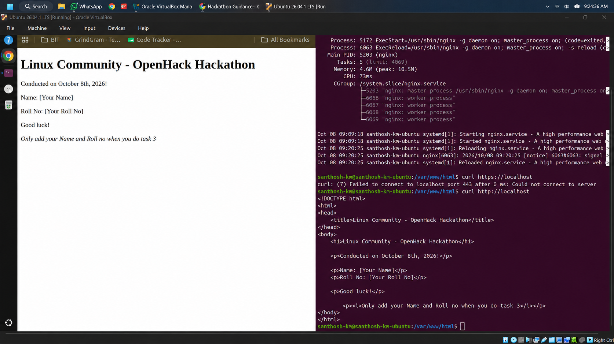
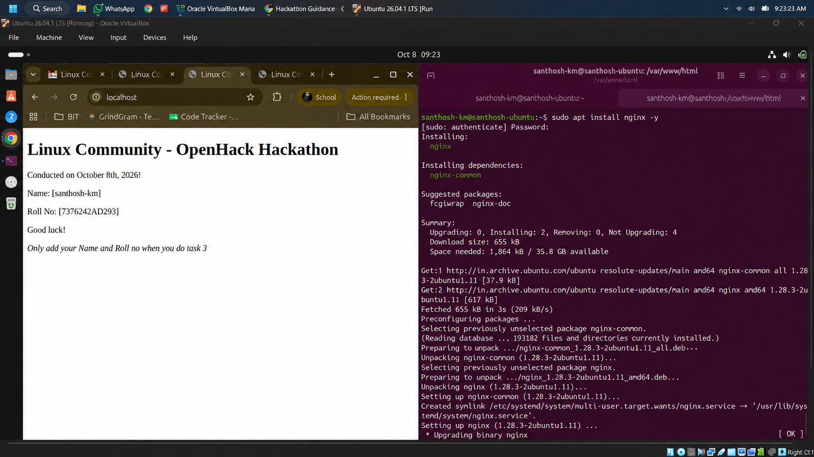
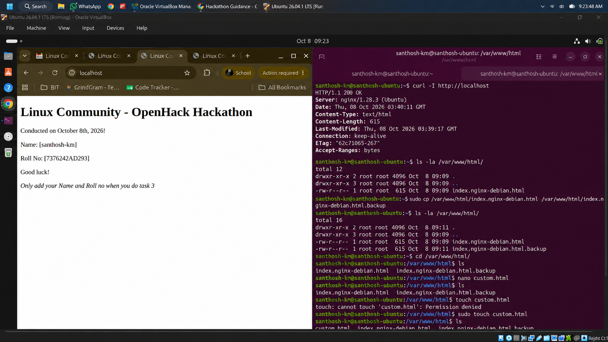
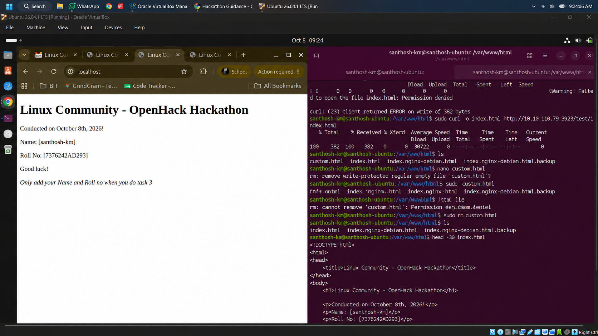
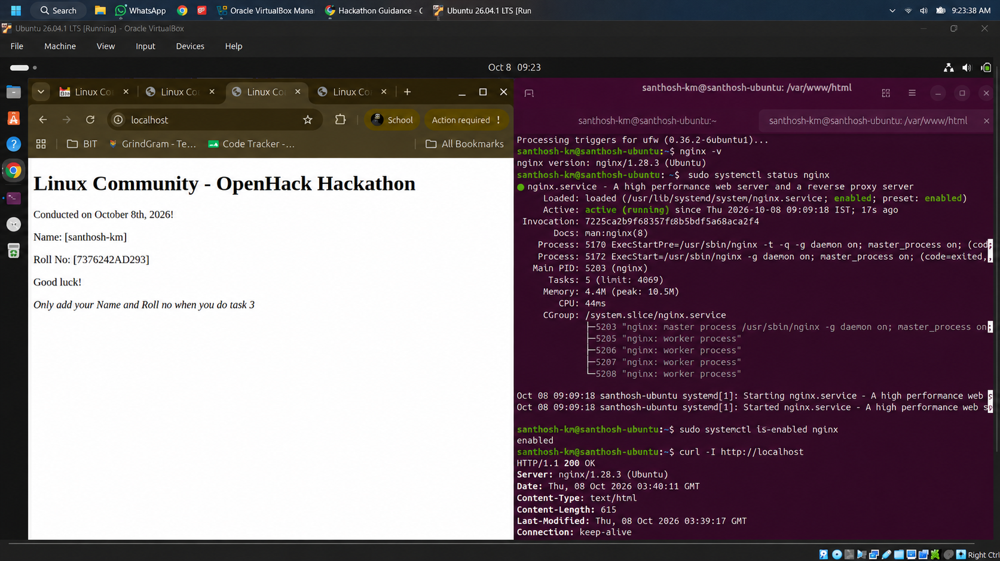

# 🚀 Task 1: Set Up Nginx Web Server & Host Custom HTML Page

## 🎯 Objective
Install and configure an Nginx HTTP web server on an Ubuntu Linux environment to host and serve a custom HTML template provided by hackathon organizers.

---

## 💻 System Specifications & Stack
- **OS:** Ubuntu Linux (Ubuntu 26.04 LTS / VirtualBox)
- **Web Server:** Nginx 1.28.3
- **Commands:** `apt`, `systemctl`, `curl`, `chmod`, `nginx -t`, `ls`, `rm`

---

## 📝 Step-by-Step Implementation Workflow

### Step 1: Preview Provided Custom HTML Page Template
Inspect the initial HTML template structure provided by hackathon organizers.



*Figure 1.1: Organizer custom HTML landing page layout.*

---

### Step 2: Package Update & Nginx Installation
Update system package repositories and install Nginx web server:

```bash
sudo apt update
sudo apt install nginx -y
```



*Figure 1.2: Successful Nginx package installation log.*

---

### Step 3: Nginx Service Status & HTTP 200 Health Check
Verify Nginx service initialization and local HTTP header response:

```bash
# Check installed Nginx version
nginx -v

# Verify active status
sudo systemctl status nginx

# Verify HTTP response code
curl -I http://localhost
```


*Figure 1.3: Nginx active status confirmation and HTTP/1.1 200 OK header output.*

---

### Step 4: Backup Web Root & Configure Permissions
Backup default Nginx index file and navigate to `/var/www/html/`:

```bash
cd /var/www/html/
sudo cp index.nginx-debian.html index.nginx-debian.html.backup
ls -la /var/www/html/
```



*Figure 1.4: Web root directory inspection and index backup creation.*

---

### Step 5: Download Organizer Custom HTML Page
Fetch custom HTML file into web root `/var/www/html/index.html`:

```bash
sudo curl -o index.html http://10.10.110.79:3923/test/index.html
```



*Figure 1.5: Fetching organizer index.html file into web root.*

---

### Step 6: Verify HTML Structure & Test Nginx Syntax
Inspect HTML contents and perform Nginx configuration syntax check:

```bash
# View template content
head -30 index.html

# Test configuration syntax
sudo nginx -t

# Reload Nginx daemon
sudo systemctl reload nginx
```



*Figure 1.6: Validating HTML code structure, testing Nginx configuration, and reloading service.*

---

## 🏆 Task 1 Outcome
Task 1 completed successfully. Nginx server is actively running and serving the custom HTML page locally at `http://localhost`.
