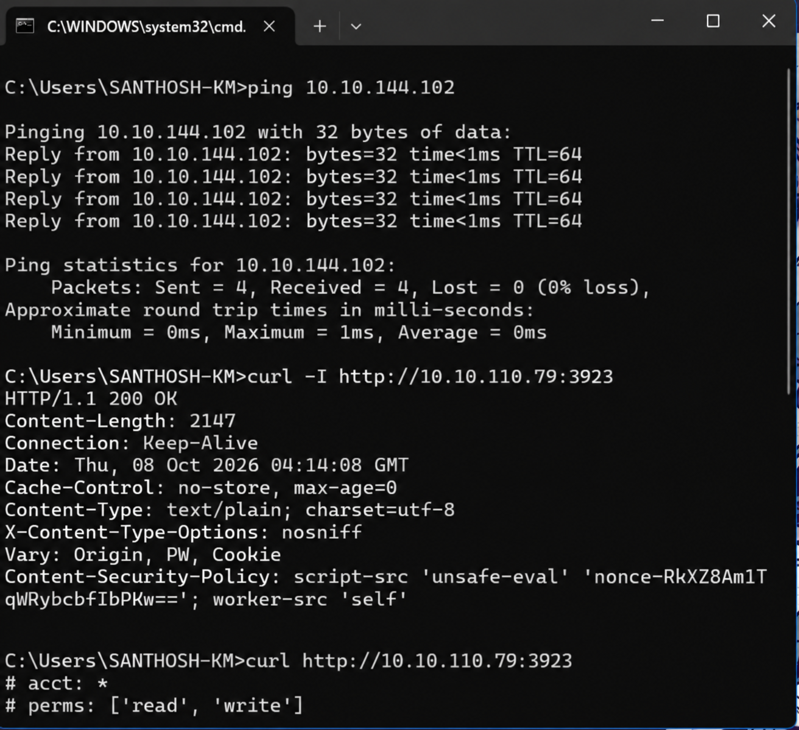
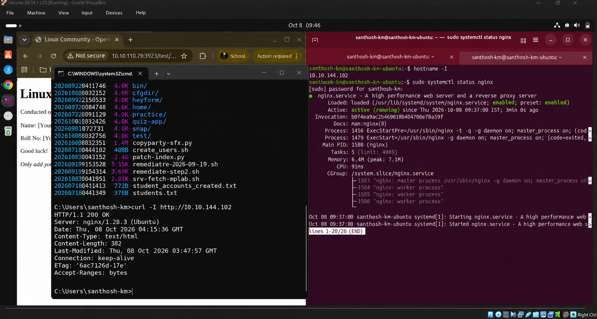

# 🌐 Task 2: Access Hosted Page Across Local Area Network (LAN)

## 🎯 Objective
Verify LAN accessibility of the Nginx web server hosted on the primary Linux host machine (`10.10.144.102`) from a remote client computer connected to the same network.

---

## 🖥️ Network System Roles

| Role | Operating System | IP Address | Utility Tested |
| :--- | :--- | :--- | :--- |
| **Server Host** | Ubuntu Linux 26.04 LTS | `10.10.144.102` | Nginx HTTP Daemon |
| **Remote Client** | Windows 11 Client | LAN Subnet | CMD / PowerShell / Browser |

---

## 📝 Execution & Verification Steps

### Step 1: Retrieve Host IP & Confirm Service Status
On the Linux server host, identify the internal network IP address:

```bash
hostname -I
sudo systemctl status nginx
```

---

### Step 2: Ping Reachability Test from Remote Client
From the remote Windows client machine, execute a ICMP network ping test to the server IP:

```cmd
ping 10.10.144.102
```



*Figure 2.1: Ping reachability test showing 0% packet loss and active Nginx server status.*

---

### Step 3: Remote HTTP Header & Content Inspection via `curl`
Execute HTTP header and body fetch from client command prompt:

```cmd
curl -I http://10.10.144.102
curl http://10.10.144.102
```



*Figure 2.2: Fetching HTTP 200 OK headers and HTML content remotely via `curl`.*

---

## 🏆 Task 2 Outcome
Task 2 completed successfully. The Nginx hosted HTML page is fully accessible across the local network via terminal tools and browser navigation.
