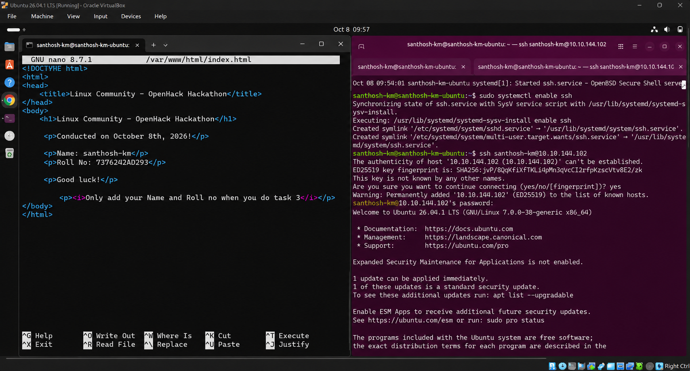
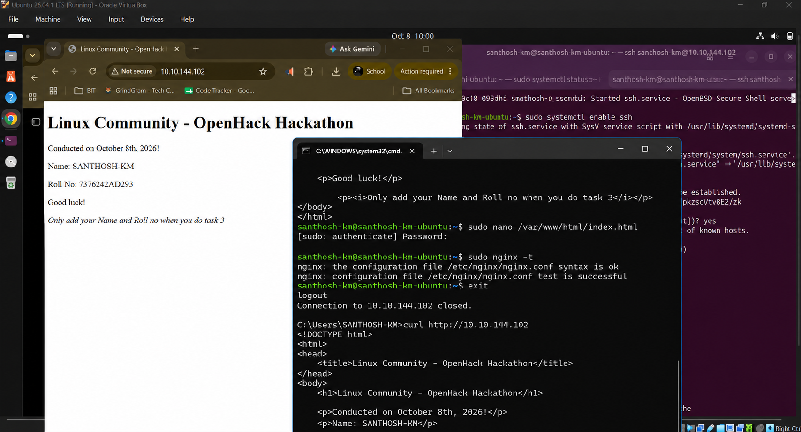

# 🔑 Task 3: Remote SSH HTML Modification & Student Detail Update

## 🎯 Objective
Establish a secure SSH remote terminal session from a remote client computer to the Linux web server, edit `/var/www/html/index.html` to insert student credentials (**SANTHOSH KM** and **7376242AD293**), and verify live webpage reflection.

---

## 📝 Step-by-Step SSH Workflow

### Step 1: Enable OpenSSH Daemon on Host
On the Linux host machine, ensure SSH server is active:

```bash
sudo apt install openssh-server -y
sudo systemctl enable --now ssh
```

---

### Step 2: Connect via SSH & Edit HTML File
From remote client terminal, connect over SSH and edit web template using `nano`:

```bash
ssh santhosh-km@10.10.144.102
sudo nano /var/www/html/index.html
```

**Added Student Credentials:**
```html
<p>Name: SANTHOSH KM</p>
<p>Roll No: 7376242AD293</p>
```



*Figure 3.1: Remote SSH session editing `/var/www/html/index.html` via `nano` editor.*

---

### Step 3: Test Syntax & Verify Live Update in Browser
Validate configuration, exit SSH session, and query webpage from client:

```bash
sudo nginx -t
exit

# From Client Machine
curl http://10.10.144.102
```



*Figure 3.2: Verification of live webpage updates showing SANTHOSH KM & 7376242AD293 in web browser.*

---

## 🏆 Task 3 Outcome
Task 3 completed successfully. The HTML landing page was modified remotely over SSH, and updated student details are live on the network server.
