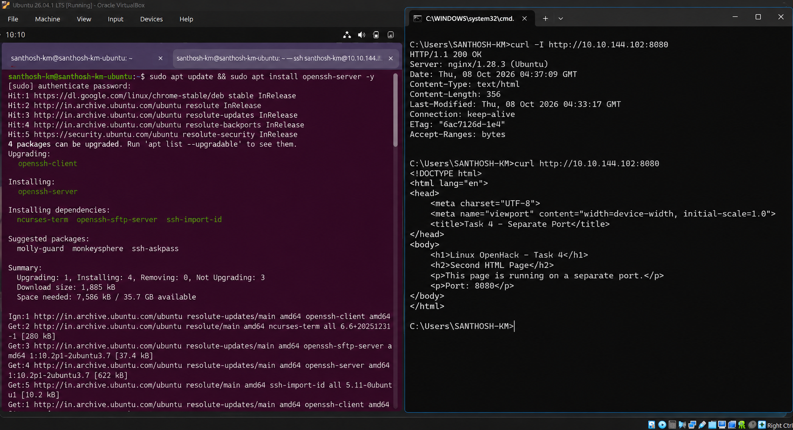
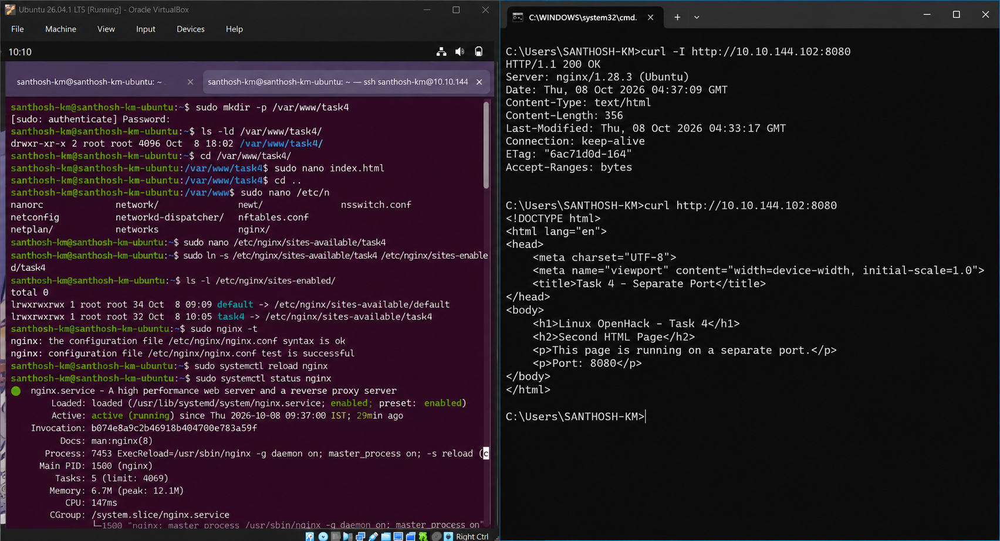
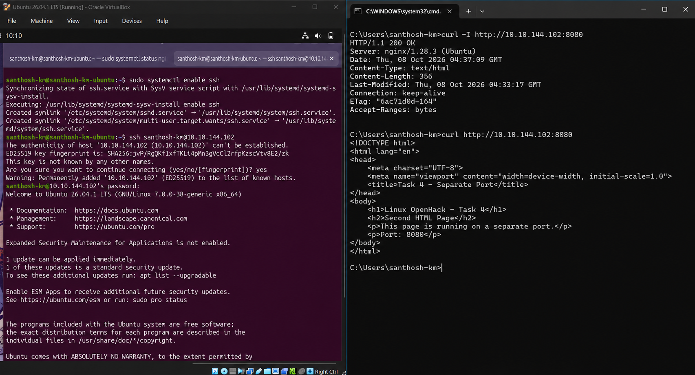
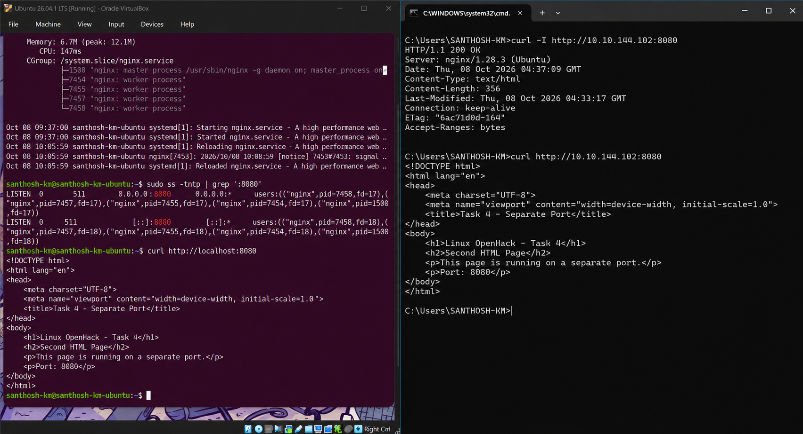

# 🔌 Task 4: Configure Nginx Virtual Host on Separate Port (Port 8080)

## 🎯 Objective
Configure Nginx to serve an independent second web page on TCP port `8080` alongside the default web application on port `80`.

---

## 📝 Step-by-Step Technical Execution

### Step 1: Create Dedicated Web Directory & Second HTML Site
Provision new document root `/var/www/task4/` and create second site `index.html`:

```bash
sudo mkdir -p /var/www/task4
sudo nano /var/www/task4/index.html
```

---

### Step 2: Nginx Site Virtual Host Block Setup
Create new site configuration in `/etc/nginx/sites-available/task4`:

```nginx
server {
    listen 8080;
    listen [::]:8080;

    root /var/www/task4;
    index index.html;

    server_name _;

    location / {
        try_files $uri $uri/ =404;
    }
}
```

---

### Step 3: Enable Site Symlink & Reload Nginx
Link configuration to `sites-enabled` and reload daemon:

```bash
sudo ln -s /etc/nginx/sites-available/task4 /etc/nginx/sites-enabled/task4
sudo nginx -t
sudo systemctl reload nginx
```



*Figure 4.1: Symlinking Virtual Host block, syntax testing, and reloading Nginx.*

---

### Step 4: Verify Active Listening Socket (Port 8080)
Inspect listening TCP sockets using `ss` tool:

```bash
sudo ss -lntp | grep ':8080'
curl http://localhost:8080
```



*Figure 4.2: Confirming active Nginx socket listener on port 8080 via `ss -lntp`.*

---

### Step 5: Dual Port Browser & Network Test
Access Port 80 (Main Site) and Port 8080 (Task 4 Site) simultaneously:

```cmd
curl http://10.10.144.102:8080
```



*Figure 4.3: Side-by-side browser rendering of Port 80 and Port 8080 web applications.*



*Figure 4.4: Remote client HTTP response verification for port 8080.*

---

## 🏆 Task 4 Outcome
Task 4 completed successfully. Nginx is serving dual independent sites on port `80` and port `8080`.
