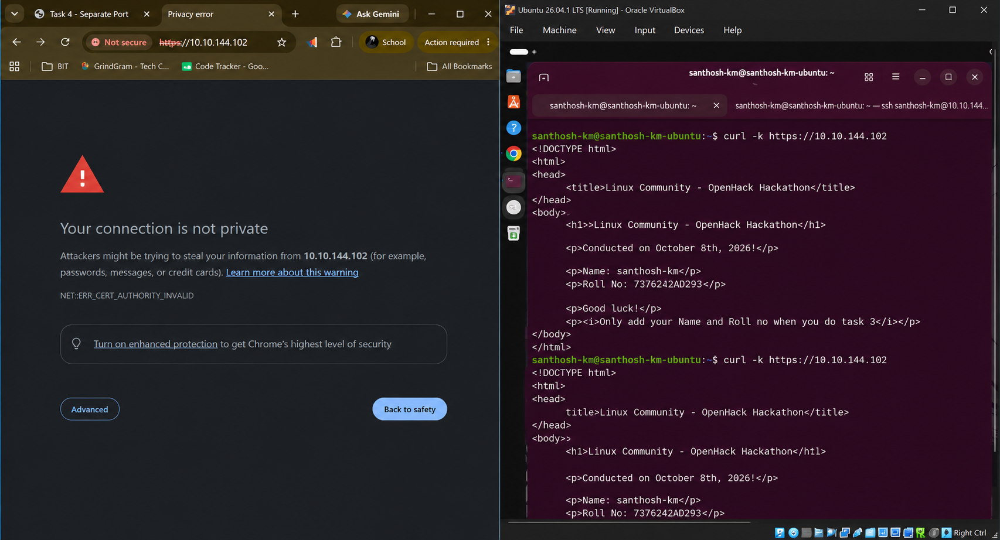

# 🔒 Task 5: HTTPS Conversion & SSL/TLS Encryption (Port 443)

## 🎯 Objective
Migrate the primary web application on port `80` to secure HTTPS on port `443` using an OpenSSL self-signed certificate.

---

## 📝 Step-by-Step SSL/TLS Setup

### Step 1: Generate Self-Signed RSA 2048-bit Certificate
Create private key and public certificate pair:

```bash
sudo openssl req -x509 -nodes -days 365 -newkey rsa:2048   -keyout /etc/ssl/private/nginx-selfsigned.key   -out /etc/ssl/certs/nginx-selfsigned.crt
```

---

### Step 2: Configure Nginx SSL Server Block
Update `/etc/nginx/sites-available/default` to enable SSL listening on port `443`:

```nginx
server {
    listen 80 default_server;
    listen [::]:80 default_server;

    listen 443 ssl default_server;
    listen [::]:443 ssl default_server;

    ssl_certificate /etc/ssl/certs/nginx-selfsigned.crt;
    ssl_certificate_key /etc/ssl/private/nginx-selfsigned.key;

    root /var/www/html;
    index index.html;

    server_name _;

    location / {
        try_files $uri $uri/ =404;
    }
}
```

---

### Step 3: Test Syntax & Verify Secure Access
Validate configuration and query HTTPS endpoint via `curl -k`:

```bash
sudo nginx -t
sudo systemctl reload nginx

# Test secure HTTPS endpoint
curl -k https://10.10.144.102
```



*Figure 5.1: `curl -k https://10.10.144.102` output and SSL certificate warning page in Chrome.*

---

## 🏆 Task 5 Outcome
Task 5 completed successfully. The web server is fully migrated to HTTPS on port `443` with SSL/TLS encryption.
